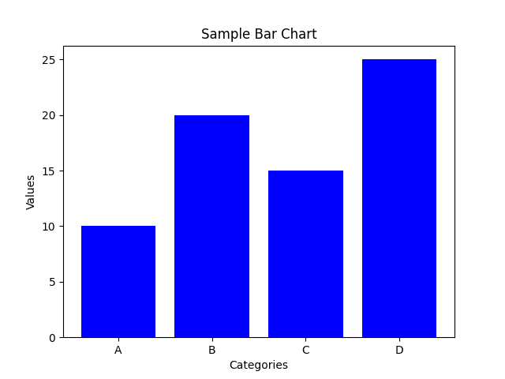
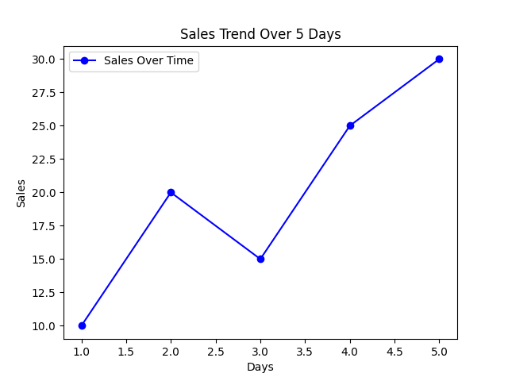

Routing Analysis in Geographic Information Systems (GIS) is the process of determining the most efficient path or route between two or more locations based on various criteria such as distance, travel time, cost, or specific conditions (e.g., avoiding tolls, traffic congestion, or restricted zones).

# Sample Bar Chart

This is a sample bar chart generated using Matplotlib:

# Sample Line Graph

This is a sample Line chart generated using Matplotlib:

