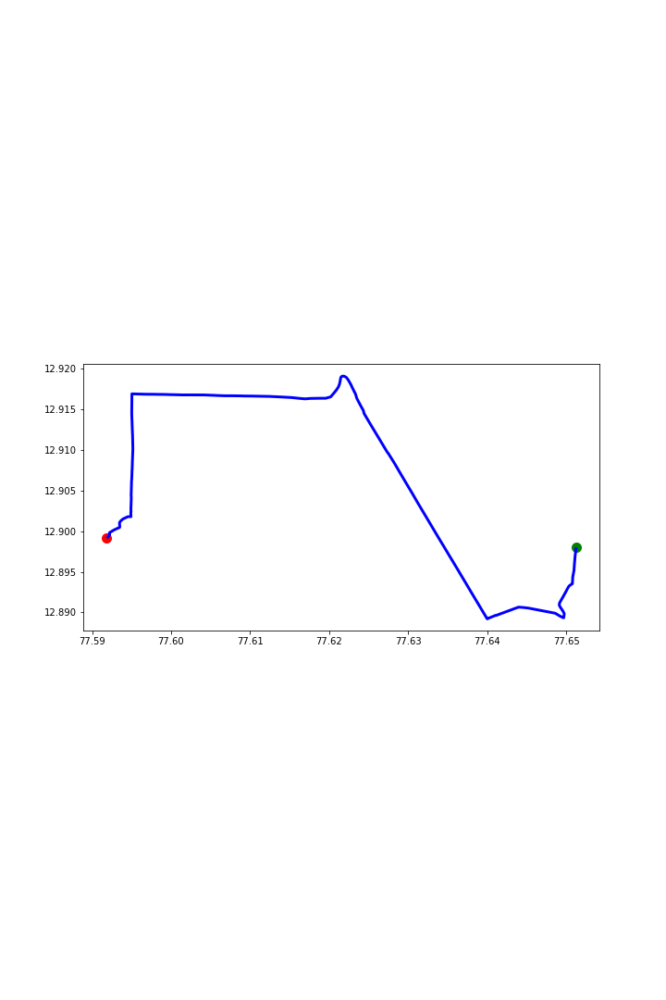

Routing Analysis in Geographic Information Systems (GIS) is the process of determining the most efficient path or route between two or more locations based on various criteria such as distance, travel time, cost, or specific conditions (e.g., avoiding tolls, traffic congestion, or restricted zones).

<!-- # Sample Bar Chart

This is a sample bar chart generated using Matplotlib:

 -->

<!-- 
# Sales Trend Over 5 Days

This is a sample line graph generated using Matplotlib:

 -->

# Network mapping form Source to Destination

This is a shortest route generated based on PG-Routing visualizing the data using Matplotlib USER-I:

This is a shortest route generated based on PG-Routing visualizing the data using Matplotlib USER-II:

